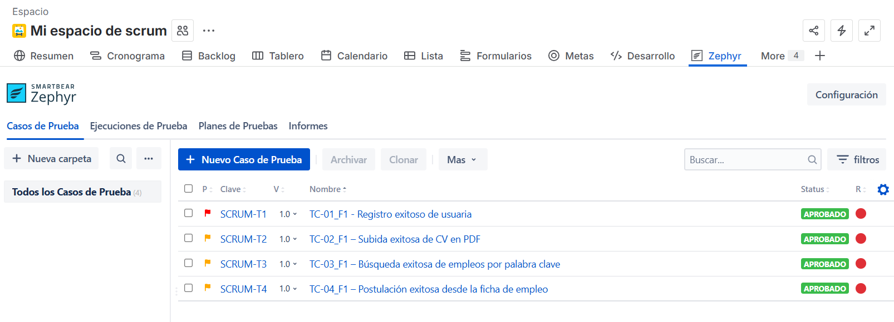
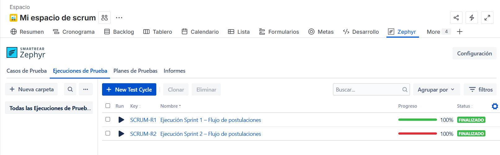
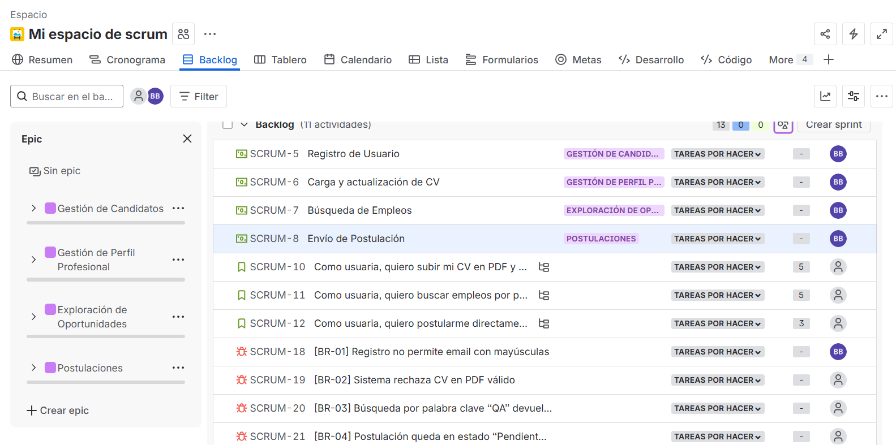
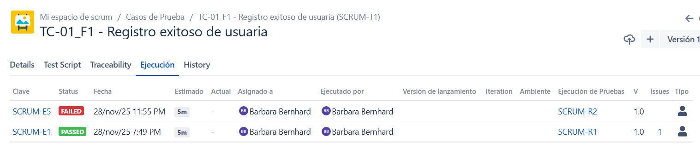

# Portfolio de Testing QA Manual - TalentoLab

Proyecto final desarrollado durante la formación de **Testing QA de Talento Tech / GCBA**. El objetivo fue analizar y validar el flujo de postulaciones del portal educativo TalentoLab mediante planificación, diseño de casos, ejecución en dos ciclos y seguimiento de defectos con Jira y Zephyr.

## Resultado general

- 4 casos de prueba funcionales diseñados.
- 2 ciclos de ejecución finalizados al 100 %.
- 8 ejecuciones registradas en total.
- 3 defectos funcionales confirmados y abiertos al cierre: BR-02, BR-03 y BR-04.
- Reejecución de los casos para validar regresión y persistencia de defectos.

## Funcionalidades evaluadas

1. Registro de una nueva persona usuaria.
2. Carga de un CV válido en formato PDF.
3. Búsqueda de empleos por palabra clave.
4. Postulación desde la ficha de una vacante.

## Herramientas y prácticas

- Jira para backlog, historias y defectos.
- Zephyr para diseño y ejecución de casos de prueba.
- Testing funcional y de regresión.
- Análisis de requerimientos y criterios de aceptación.
- Documentación de resultados, evidencias y trazabilidad.
- Trabajo organizado en sprints.

## Contenido del repositorio

```text
qa-portfolio/
|-- README.md
|-- docs/
|   `-- test-plan.md
|-- test-cases/
|   `-- test-cases.md
|-- bug-reports/
|   `-- bug-reports.md
|-- metrics/
|   `-- test-summary.md
`-- evidence/
    |-- jira-backlog-bug-reports.png
    |-- zephyr-execution-history.png
    |-- zephyr-test-cases-overview.png
    `-- zephyr-test-cycles.png
```

## Evidencias

### Casos de prueba documentados



### Ciclos de ejecución



### Backlog y defectos



### Historial de ejecución



## Documentación

- [Plan de pruebas](docs/test-plan.md)
- [Casos de prueba y resultados](test-cases/test-cases.md)
- [Reportes de defectos](bug-reports/bug-reports.md)
- [Resumen de ejecución y métricas](metrics/test-summary.md)

## Alcance y privacidad

Este repositorio documenta un proyecto académico realizado sobre un entorno de práctica. No contiene credenciales, tokens, datos personales de terceras personas ni información de producción.

## Autora

**Barbara Bernhard**<br>
[LinkedIn](https://www.linkedin.com/in/barbara-bernhard/) | [GitHub](https://github.com/Barbyland)

---

## English summary

Manual QA portfolio created as the final project for the Talento Tech QA Testing program. It documents requirements analysis, four functional test cases, two completed execution cycles, regression testing and three confirmed defects using Jira and Zephyr.
